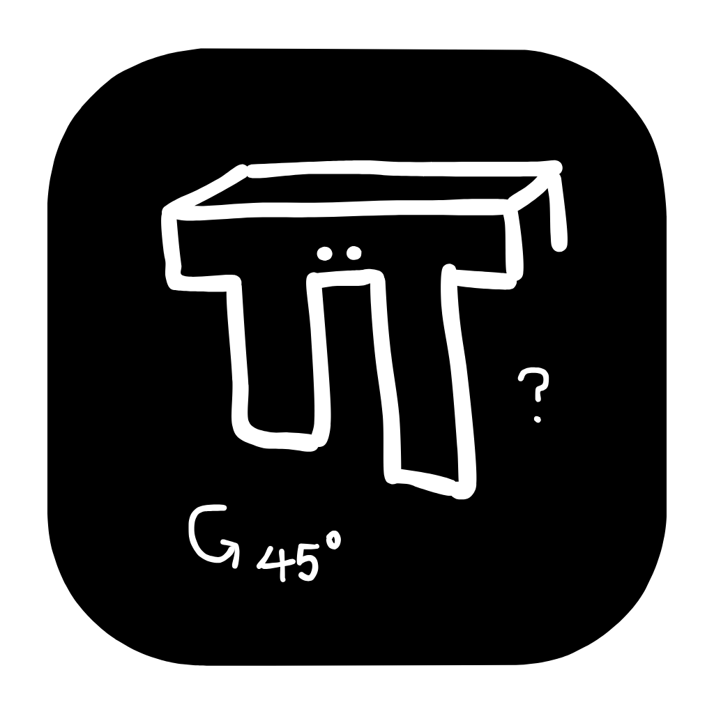
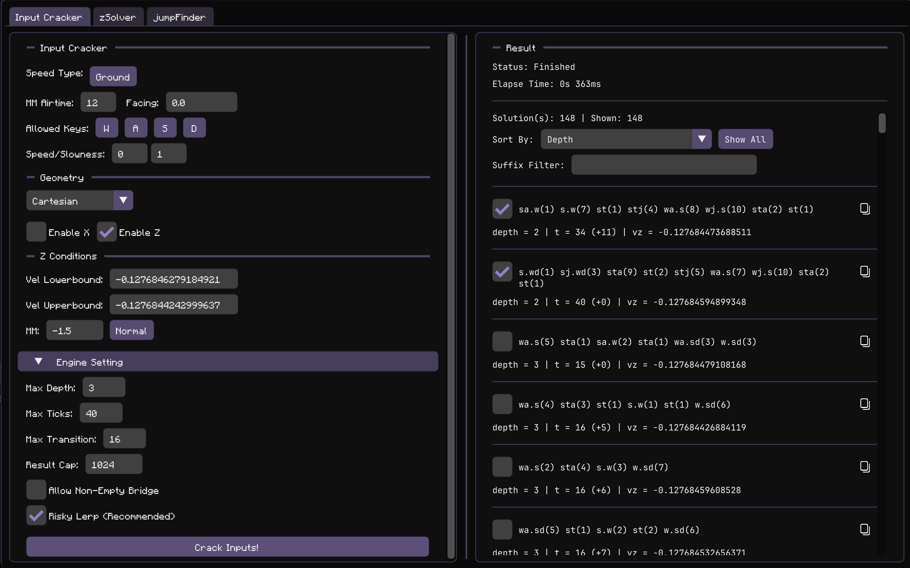
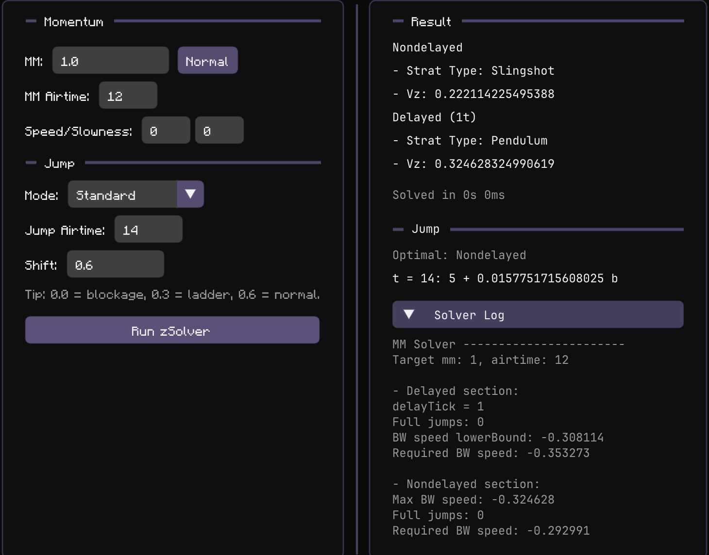
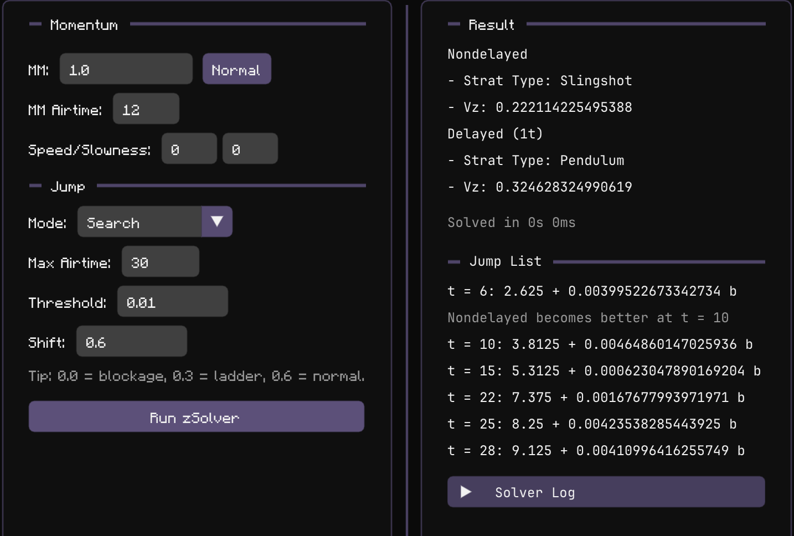
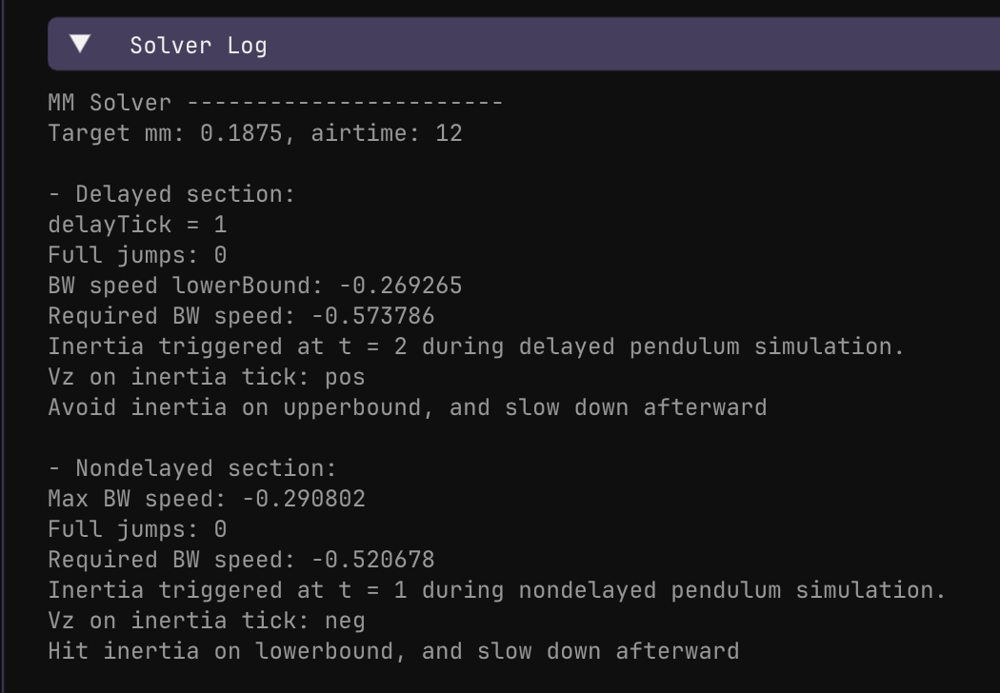

# Stratfinder

Stratfinder is a GUI tool for finding **Optimal Minecraft Parkour Strategies** (OMPS, but actually there is no such abbreivation), with a focus on **single-axis distance jump problems**.

It currently ships with three main tools:

- **Input Cracker** — reverse-search input sequences that match a target velocity window.
- **zSolver** — solve for the best delayed / nondelayed setup for a given MM and airtime.
- **jumpFinder** — sweep ranges of MM / airtime / potion effects and report matching jumps.

> Original inspiration: Cantnavet's [BMSolver](https://github.com/cantnavet/BmSolver).

---

## Preview

---

## What can you do with the program

### 1. Solve for optimal strat in a momentum 
Given an MM value and MM airtime, `zSolver` computes the best **delayed** and **nondelayed** strategies and returns the required velocity and strategy label.

### 2. Check whether a setup produces usable jumps
`zSolver` can also scan airtimes and tell you whether a setup lands close enough to a pixel boundary under a chosen threshold / shift.

### 3. Reverse engineer inputs from a target speed window
`Input Cracker` searches for input sequences that end inside a target velocity interval, with optional X/Z constraints, facing, allowed keys, and MM bounds.

### 4. Sweep large search spaces automatically
`jumpFinder` searches many MM / airtime / potion combinations and returns all matches that satisfy your threshold and shift settings.

---

## Features

- Supports both **1.8.9** and **Modern** movement presets.
- Supports **normal** and **backwalled** MM solving.
- Supports **Cartesian** (`Vx`, `Vz`) and **Polar** ( norm + angle ) cracking modes.
- Lets you restrict the search to selected keys (`W`, `A`, `S`, `D`).
- Other advanced cracker engine settings for fine tuning.
- Includes async search + halt support for long runs.

---

## How to use

## Input Cracker

This tab searches for input sequences that end inside a target speed window.

### Steps

1. Choose **Version** (`1.8.9` or `Modern`).
2. Choose **Speed Type**:
   - **Ground** = match the final grounded speed.
   - **Air** = match the final airborne speed.
3. Set **MM Airtime**.
4. Set **Facing** in degrees.
5. Enable / disable allowed keys (`W`, `A`, `S`, `D`).
6. Set potion effects with **Speed / Slowness**.
7. Choose a geometry mode:
   - **Cartesian**: search by `Vx` / `Vz` intervals.
   - **Polar**: search by speed norm + angle range.
8. **Important:** choose a suitable engine setting.
9. Run **Crack Inputs!**

### Cartesian mode

Use this when you already know the target `Vx` and/or `Vz` interval.

For each enabled axis, set:

- **Vel Lowerbound/Upperbound**
- **MM (Normal / Walled)**

**Important Note:** the MM is directional. 

If set negative, the cracker expect you to go backward after the input. Vice versa...

**Example (see if you understand):** For bwhh, you want `MM < 0`, `Vel Lb/Ub > 0` and `Speed Type = Air`.

### Polar mode

Use this when you want to describe the target by:

- speed magnitude (`Norm Lowerbound/Upperbound`)
- angle range (`Angle 1`, `Angle 2`)
- X / Z MM bounds (**directional**)

Internally, the search still works through Cartesian bounds, but the it filters results back to the requested norm/angle region.

This may be useful for strategies that you could move facings around to fit in the mm if it doesn't fit exactly.

### Engine Settings

### Max Ticks

Maximum allowed total sequence length.

This is a hard cap on how long a candidate sequence can run.

Value too high makes cracker walks into giberish that hits inertia mid sequence and produce no variants (wasting time).

### Max Depth

Whether the input transitions to a new key. Depth is incremented.

For example: `sa.w(1) s.wa(3) s.wa(1) wj.s(12) w.s(1)` is a depth-3 input because the keystroke goes from `W -> WA -> S`.

**Exception: The transition rule (next section)**

Higher depth:

- finds more complex solutions
- increase search space quickly

If no solution appears, increasing depth is one of the first things to try.

### Max Transition (the confusing part but important)

One may argue that `s(2) wj.s(12) w.s(1)` is the same difficulty as `s(2) st(1) wj.s(12) w.s(1)`. Despite the latter being one depth more expensive.

That is because `st(1)` act as an transition bridge. It increases the length of the transition, but does not add complexity.

In general, for keystroke that goes like this `front -> bridge -> back`. And when `bridge` is exactly the intersection set of `front` and `back`. The bridge doesn't add more complexity mechanically.

The transition rule refunds depth when the `bridge` is a valid smooth transition.

But the complexity timing wise may be debatable, that's why there is `max tranition length`. If the transition is too long, the timing may become a challenge itself.

Setting convention:

- `0` = disable refunded transitions
- positive value = allow refunded transitions up to that many ticks
- negative value = no transition-time cap

Extra note: `input -> stop (and ends)` is also count as transition. It doesn't get affected by transition time but when you set this setting to 0, it will now cost depth. (Maybe it should be a seperate setting)

### Allow Non-Empty Bridge

From above, `bridge` could be anything.

For example: `w.sd(2) wj.s(2) wa.sa(10) w.sa(1)` has `S` key as bridge between `SD` and `SA`.

But from my testing `bridge` that isn't `stop` increases search space while bringing barely any more solutions.

Disable this setting forces the `bridge` to be an empty input (stop).

### Risky Lerp

This is enabled by default in the UI and is a lot faster. 

**Important caveat:** with risky pruning enabled, the search **may skip inputs that require inertia**.

**(in my experience risky lerp rarely misses input)**

So if you strongly suspect a valid sequence exists but the cracker finds nothing, try turning this **off**.

### Reading the results

Each result shows:

- **mothball string:** The input sequence
- **depth:** explained above
- **t:** Length of the input in ticks.
- **(+airDebt):** Plus the additional prejump time. For example you need 11t extra ticks from jump until you can do a7.
- final `vx` / `vz` or norm / angle

You can:

- copy the sequence with the copy button
- mark interesting results with the checkbox
- sort by different rankings
- filter by suffix

---

## ZSolver

This tab solves for the best strategy for a given MM setup.

### Basic workflow

1. Choose **Version**.
2. Enter **MM**.
3. Choose **Normal** or **Backwalled**.
4. Enter **MM Airtime**.
5. Set **Speed / Slowness** if applicable.
6. Choose **Mode**:
   - **Search**
   - **Standard**
7. Set **Shift**.
8. Run **Run zSolver**.

### Standard mode

Use this to evaluate **one specific jump airtime**.

**1bm 5-1:**

### Search mode

Use this to find:

> “For this MM setup, which tier produce precise jumps within a landing threshold?”

## Output notes

### Strategy names

hese are the strategy labels used internally by the solver and shown in the UI.

The solver can return labels such as:

**Normal Strat:**

- **Slingshot:** BW speed into a full sprint jump
- **True Robo:** BW speed into hh such that `bw speed + hh tick speed` is negative.
- **Robo:** BW speed into hh and is not true robo.
- **Boomerang:** BW speed into fw air strat that is equivalent to initial fw air speed into sprint jumps.
- **Pendulum:** The maximum BW speed it could produce into the best FW strat(angled sprint jump) it could fit.

**Backwalled Strat:**

- **Angled Sj:** Angle intial jump tick sprint jumps.
- **Pessi:** Air fw into sprint jumps.
- **Pessi + Run** Air fw into ground fw into sprint jumps.
- **Run:** Ground fw into sprint jumps.

### Solver log

`zSolver` exposes an internal log in the output panel. This is especially useful when you want to understand **why** the solver chose a certain branch or why one family failed. (Although it is not very descriptive at the moment)

**"Yapping about how it finds a better 0.1875bm loop than in benja's optimal loop strat video"**

---

## Jump Finder

This tab scans a range of conditions and reports all matches.

### Steps

1. Choose **Version**.
2. Enter an **MM range**.
3. Enter an **MM Airtime range**.
4. Enter **Speed / Slowness ranges**.
5. Set **Max Jump Airtime**.
6. Set **Threshold**.
7. Select one or more **Shift** presets (Normal/Ladder/Blockage/Water).
8. Run **Start Jump Finding**.

It doesn't matter if you set MM max to 5000 or 10000 blocks. It predicts that no more new jumps will be found and skips them. (By comparing the jumpList to the calculated terminal velocity)

---

## Limitations of zSolver

- Can only do constant mm airtime single axis distance jump
- Cannot find every useful strategies, it only finds the optimal ones.
- The solutions are not really constructive. (partially calculated)
- But it is super efficient and the algorithms are cool.